# Lab 1: Environment Setup

## Introduction
In this lab, we will focus on configuring our environment using an IDE and the Checkmarx plugin.  While Checkmarx supports multiple IDEs, we will be leveraging Eclipse in this lab.  Checkmarx has integrated plugins with the following IDEs:

* Eclipse **(Currently only Eclipse 2022 is supported)**
* IntelliJ
* Visual Studio
* VS Code

To learn more, checkout <a href="https://checkmarx.com/why-checkmarx/integrations/checkmarx-integrations-with-ides/" target="_blank">Checkmarx Integrations with Popular IDEs</a>

{: .warning }
For these labs, we are using a known vulnerable Java project based heavily on <a href="https://github.com/k-tamura/easybuggy" target="blank">EasyBuggy</a> to demonstrate vulnerability detection and remediation capabilities.  Note that if this application is run, this Java application can result in system crashes as a result of memory leaks, deadlock, JVM crashes, etc.  In these labs, we are only using Checkmarx solutions that scan source code, thus there is no reason or need to run this project and __it is not recommended to do so__. If you do wish to run the project, do so at your own risk. It is HIGHLY recommended you do so in a sandbox environment (e.g. within a VM)

## Install Eclipse
The first step is to install Eclipse, if you don't already have it installed.

{: .note }
If you already have Eclipse installed, you can skip this section. When we are done with the lab, you can always uninstall/disable the Checkmarx plugin

1.	Navigate to <a href="https://www.eclipse.org/ide/" target="_blank">https://www.eclipse.org/ide/</a> to download the Eclipse installer for your operating system.
2.	Run the installer.

## Install the Checkmarx Extension
Once Eclipse is installed, we need to install the Checkmarx IDE extension. The Checkmarx Eclipse Extension is available on the <a href="https://marketplace.eclipse.org/content/checkmarx-ast-plugin" target="_blank">Eclipse Marketplace</a>. You can initiate the installation directly from the Eclipse Marketplace.

1. Open Eclipse
2. Within the Eclipse console, click **Help > Eclipse Marketplace...**
3. In the **Find** box, enter "Checkmarx" and click **Go**
    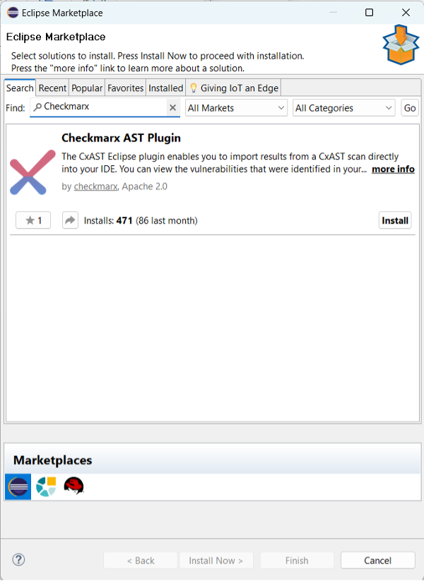

4. Click **Install** for the Checkmarx AST Plugin.
5. Click **Finish**
6. If a security warning is shown, click **Select All** and **Trust Selected**

    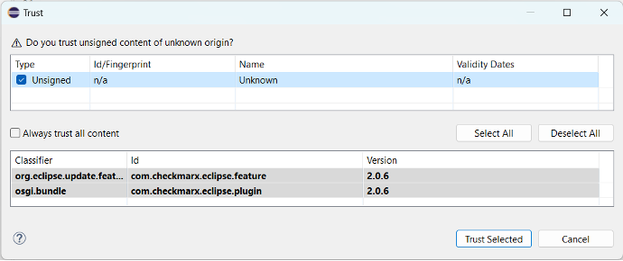
7. Eclipse will require a restart to complete the installation of the extension

## Configure the Checkmarx Extension
After installing the plugin, you need to configure access to the Checkmarx One server before you can start importing results in your Eclipse IDE.

1. In the top menu, click **Window > Preferences**. (For Mac OS, click **Eclipse > Preferences**)
    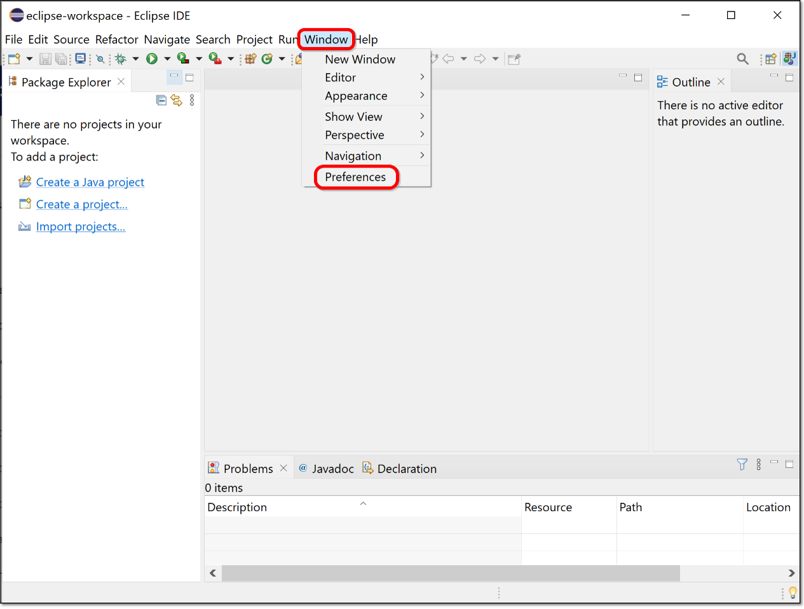

2. In the Preferences window, click Checkmarx AST (or search for Checkmarx AST in the search box). The Checkmarx One Eclipse plugin configuration settings are shown.
    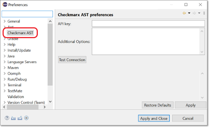

    |         Item                          |          Value                |
    |:----------------------                |:-----------------------       |
    | Checkmarx AST: Api Key       | \<provided by proctor\>                |
    | Additional Options           | \<leave blank\>                        |

3. Enter the provided API key
4. Click Test Connection to verify that the connection works.
5. Click Apply and Close to save settings.

## Import the Project into the IDE
The next step is to import the workshop project “TotallySecureApp” into Eclipse.
1.	In the top menu, click File > Import.
2.	Select Git > Projects from Git (with smart import).

    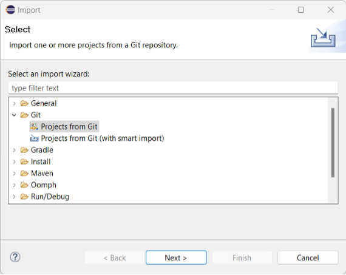

3. Select **Clone URI**
4. Paste the URI for "TotallySecureApp" [https://github.com/cxworkshops/totallysecureapp.git](https://github.com/cxworkshops/totallysecureapp.git) into the URI field and click Next.
    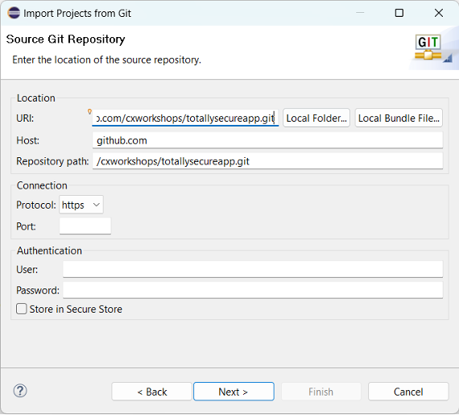
5. Select the master branch and click **Next**
    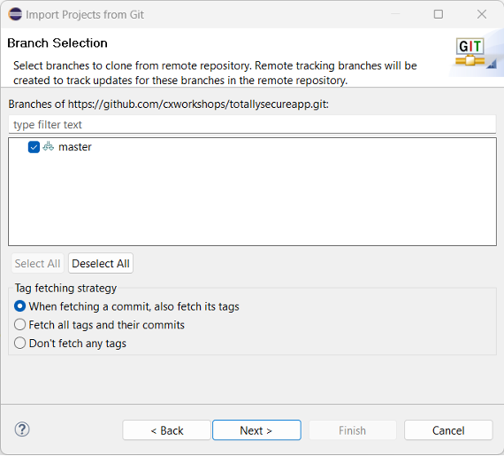
6. Choose a destination directory on your local system to store the source code and click **Next.**
    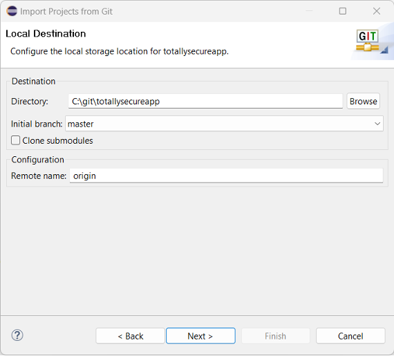
7.	Click Finish to complete the import process.

## Load scan results into the Checkmarx One extension

1.	In the top menu, click **Window > Show View > Other.**
2.	Select **Checkmarx > Checkmarx AST Scan** from the list to open the Checkmarx AST Scan view and click **Open.**
    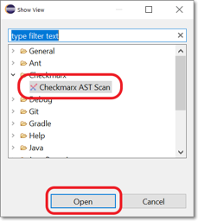
3.	The Checkmarx AST Scan panel will open at the bottom of the Eclipse window.
    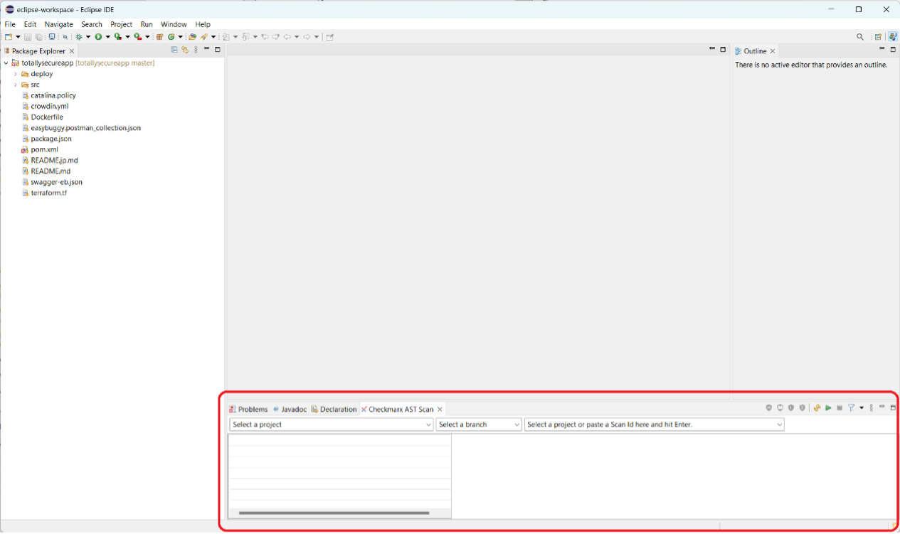
4.	Select the **TotallySecureApp** project and **master** branch; the latest scan will automatically populate and a results tree will appear. The results tree can be expanded to view results from different AST scanners (e.g., SAST, SCA).
    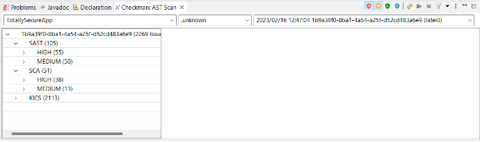
5.	Group By fields can be added by clicking the three dots on the Checkmarx AST menu. Additional filtering changes can also be made via this menu.
    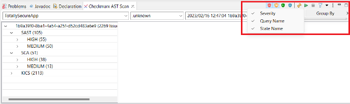
6.	Individual scan results can be selected, viewed, and updated from the results tree.
    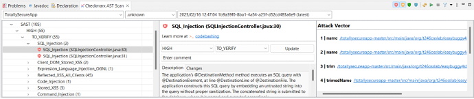 

## Key Takeaways
- Checkmarx has IDE plugins for all major IDEs
- The Checkmarx One Eclipse plugin is available within the Eclipse Marketplace. Only Eclipse 2022 is currently supported.
- The Checkmarx One Eclipse plugin can be connected to a Checkmarx One instance by configuring one field (the API Key).
- Checkmarx scan results can be reviewed all within the IDE.