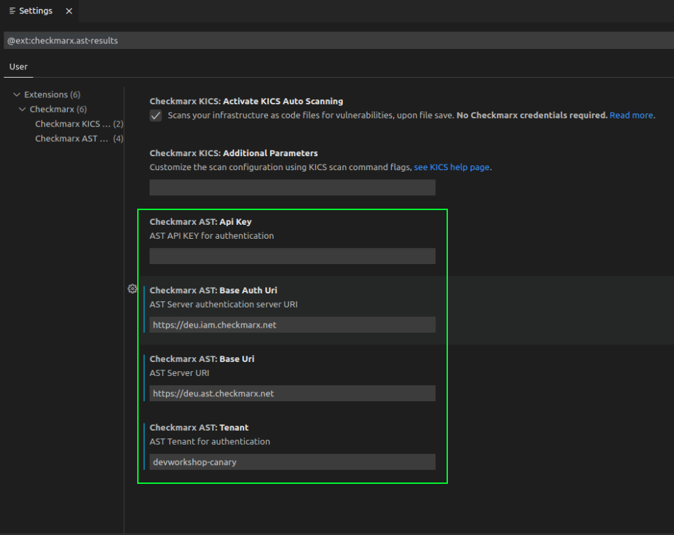
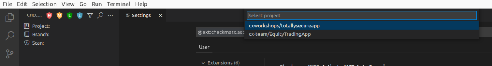
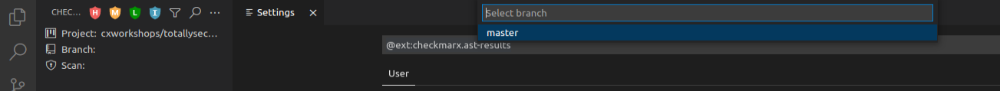
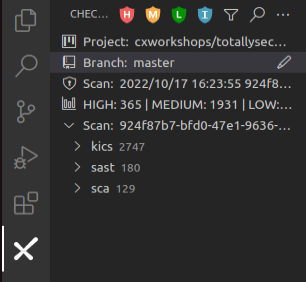

# Lab 1: Environment Setup

## Introduction
In this lab, we will focus on configuring our environment using an IDE and the Checkmarx plugin.  While Checkmarx supports multiple IDEs, for these labs we will be leverage Microsoft Visual Studio Code, as it is free and commonly used.  Checkmarx has integrated plugins with the following IDEs:

* Eclipse
* IntelliJ
* Visual Studio
* VS Code

To learn more, checkout [Checkmarx Integrations with Popular IDEs](https://checkmarx.com/why-checkmarx/integrations/checkmarx-integrations-with-ides/)

## Install VS Code
The first step is to install VS Code, if you don't already have it installed.

{: .note }
If you already have VS Code installed, you can skip this section. When we are done with the lab, you can always uninstall/disable the Checkmarx plugin

{: .highlight }
A paragraph

1. Navigate to [https://code.visualstudio.com/download](https://code.visualstudio.com/download) to download the Visual Studio Code installer for your operating system.
2. Install VS Code on your machine

## Install the Checkmarx Plugin
Once VS Code is installed, we need to install the Checkmarx plugin. The Visual Studio Code Extension is available on the [Visual Studio Code marketplace](https://marketplace.visualstudio.com/items?itemName=checkmarx.ast-results). You can initiate the installation directly from the Visual Studio Code console.

1. Open VS Code
2. Within VS Code, click the Extensions Icon
3. Type "Checkmarx" in the search prompt, then click __Install__ for that extension
    

    {: .note }
    Ensure you select the Plugin entitled "Checkmarx," not Checkmarx SAST x.x

4. The Checkmarx extension is installed and the Checkmarx icon appears in the left-side navigation panel

    

## Configure the Checkmarx Plugin
1. In the VS Code console, click on the Checkmarx extension icon and then click on the Open settings button.
The Checkmarx Settings form opens.
    

2. In the Checkmarx AST results section, for Base Uri, enter the following details:

    |         Item                 |          Value                |
    |:----------------------       |:-----------------------       |
    | Checkmarx AST: Api Key       | \<provided by proctor\>       |
    | Checkmarx AST: Base Auth Uri | https://deu.iam.checkmarx.net |
    | Checkmarx AST: Base Uri      | https://deu.ast.checkmarx.net |
    | Checkmarx AST: Tenant        | devworkshop-canary            |

3. Once entered, the Checkmarx plugin will authenticate to the Checkmarx One tenant

## Connect to a project

1. Mouse-over the __Project:__ field in the left pane, click the pencil icon, then select the project name __cxworkshops/totallysecureapp__ that appears in the middle search bar

    

2. Mouse-over the __Branch:__ field in the left pane, click the pencil icon, then select the branch __master__ that appears in the middle search bar

    

3. The Checkmarx Plugin is now configured and you should see scan results appear in the left pane

    

## Clone the project to your local machine
1. Clone our example scanned project to your local machine.

        git clone https://github.com/cxworkshops/totallysecureapp.git

    {: .note }
    You will need __git__ installed on your local machine if it is not already installed. You can use [this guide ](https://github.com/git-guides/install-git) to see the steps for your operating system

2. Within VS Code, select File > Open Folder, and select the directory totallysecureapp.

3.  You may be prompted by VS Code asking if you trust the developers. We will not be executing any of this projects code and will just be reviewing the source, so you can safely accept. Once you complete the labs, you can safely delete the project.

    

## Key Takeaways
- Checkmarx has IDE plugins for all major IDEs
- The Checkmarx One VS Code plugin is available within the Visual Studio Marketplace and is distinct from the Checkmarx SAST plugin
- The Checkmarx One VS Code plugin can be connected to a Checkmarx One instance by configuring four fields
- Checkmarx Scan results can be reviewed all within the IDE