# Lab 2: Custom Code Analysis

{: .important-title }
> Prerequisites
>
> We will be using our __totallysecureapp__ project, which is available at https://github.com/cxworkshops/totallysecureapp. If you have not already done so, clone the project to your local machine, as defined in [Lab 1](../lab1_setup/).

## Introduction
SAST, or Static Application Security Testing, enables developers and security teams to scan application source code to find, index, and enumerate weaknesses that lead to vulnerabilities within the application.  Checkmarx supports [over 30 languages and frameworks](https://checkmarx.com/resource/documents/en/34965-46283-supported-code-languages-and-frameworks-for-9-5-0.html) and leverages a set of configurable scan presets, which affords AppSec and dev teams the ability to hone the results and only focus on the results they care about.

Checkmarx SAST scans source code, not binaries, allowing teams to scan incomplete or partial code, affording an iterative approach to security. And because Checkmarx One integrates seamlessly with SCMs (GitHub, GitLab, BitBucket, Azure), we can automatically trigger scans during push and pull request events, eliminating the need to manually trigger or schedule scans

Out-of-the-box, SAST on Checkmarx One uses an optimized preset.  This preset contains a subset of vulnerabilities that the Checkmarx AppSec Accelerator team, through years of research and first-hand experience with our customers, considers to be an optimal balance between identifying critical vulnerabilities while minimizing false positives.

In addition to presets, Checkmarx SAST supports the ability to customize queries, allowing organizations to add or modify queries to help reduce false positives, add queries for custom sanitizers, or to resolve false negatives.

### Fast vs Accurate
Often Custom Code Analysis (SAST) vendors claim they are "fastest" when scanning source code, but this is almost always at the expense of accuracy. Rather than focusing on scan speed, Checkmarx focuses on accuracy _at speed_, ensuring we have the highest "True Positive" (TP) within our findings.  Afterall, if you're not finding vulnerabilities, how can you fix them (e.g. False Negatives)? Depending on the project size and the code changes, our scan engine also supports Incremental Scans, so we only scan the changed code.

Sure, speed is important, but you can think of speed-focused SAST scans as this security guard checking folks:

  

## Open the TotallySecureApp Project

1. Within VS Code, navigate to __File__ > __Open Folder...__ and select the folder to which you had previously cloned the totallysecureapp. (e.g. ~/totallysecureapp or %USERPROFILE%\\totallysecureapp)

    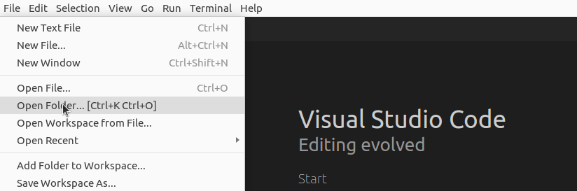

2. VS Code will open the __totallysecureapp__ folder within the explorer, where you can see the project files

    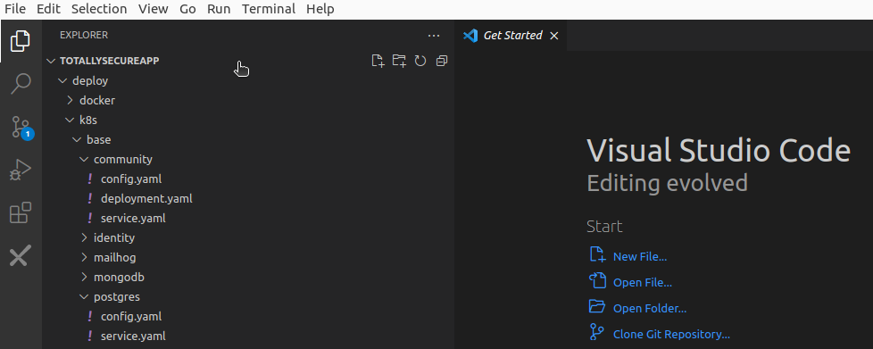

## Reviewing SAST Results

1. Within the VS Code Checkmarx plugin, expand the latest Scan result.

    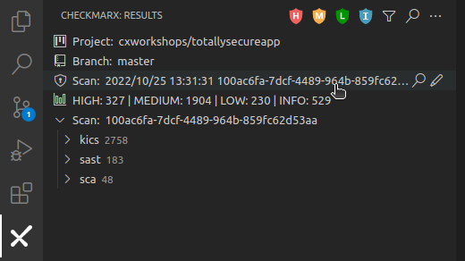

2. Click the __M__, __L__, and __I__ icons to filter out everything other than the __HIGH__ results and select the scan result __Reflected XSS All Clients (/OpenRedirectController.java:32)__.

    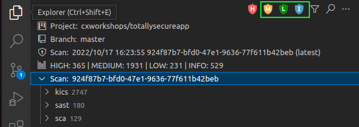

3. Expand the __sast > HIGH__ menu to review the SAST scan results
4. Select the __SQL Injection (/SQLInjectionController.java:30)__ result

    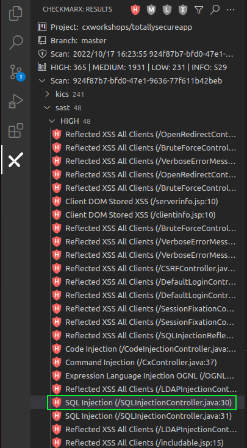

5. A pane will open with VS Code to the right, which provides a detailed description of the identified vulnerability along with the attack vector.

    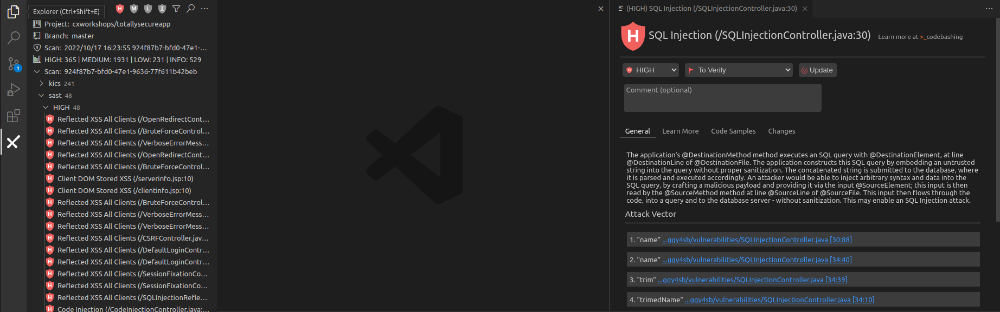

6. Because Checkmarx scans source code and builds a Data Flow Graph, it can identify the source and sink of vulnerabilities, identifying where best to implement a fix to resolve the vulnerability. Click on the first Attack Vector link, __1. "name" ...ggy4sb/vulnerabilities/SQLInjectionController.java [30:88]__, VS Code will open the specific file and highlight the parameter that Checkmarx has identified as the source of the vulnerability

    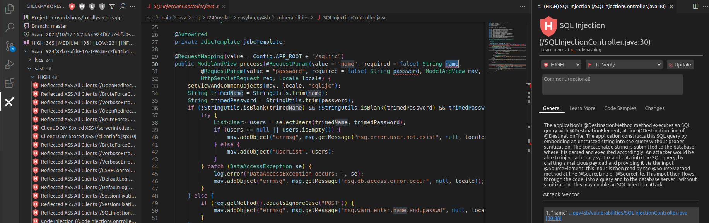

7. Reviewing the code, we can see within the result that we're taking direct input of a name and just trimming it and checking if it's blank, otherwise we pass on the input to be later executed as part of a SQL query, which could result in a SQL injection attack. Click on __Learn More__ in the far right pane to see a description of the risk in greater detail:

    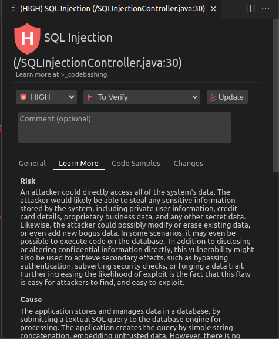

8. Click on Code Samples to see an example of how to implement a sanitizer within the code to mitigate the SQL Injection vulnerability

    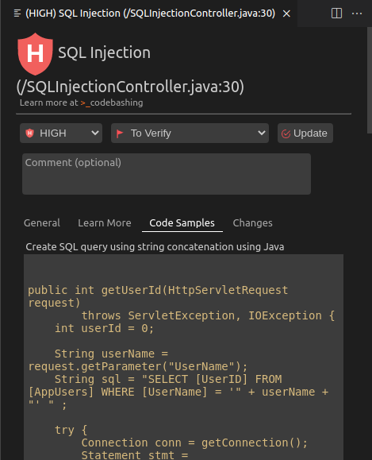

## Triaging Results
While Checkmarx SAST can identify vulnerabilities in source code by validating that sanitizers are in place since it has visibility into data flow, it is relatively limited in its ability to detect control flow based validation.  Perhaps we have validation within our application that we know will ensure our code is not subject to a vulnerability. We have the ability to triage results from within the IDE where we can mark them as "not exploitable" so they do not get returned upon future scans

1. Select any one of the __Reflected XSS All Clients__ results.

2. In the right pane, change the second drop down from __To Verify__ to __Not Exploitable__ and enter a comment, such as

        We have a validator in our code to ensure that this variable will only include known inputs.

    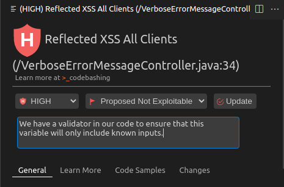

3. Click __Update__

4. The result will now disappear from the SAST High results.  If we want to review the result again, we can select the filter icon, and de-select all options other than __"Not Exploitable"__
    
    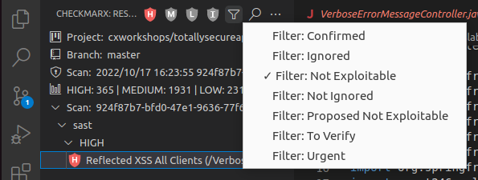

## Key Takeaways
- Checkmarx SAST scans source code rather than binaries, allowing dev teams to iteratively scan code as they build
- Checkmarx One integrates with all major SCMs and can automatically trigger scans on push and pull request events
- SAST results are viewable directly within the IDE, so you don't have to navigate to a different tool or site to review results
- We can see the "Best Fix Location" along with a detailed analysis and recommendations within the IDE to implement controls within our code
- We have the ability to triage results from within the IDE where we can mark them as "not exploitable" so they do not get returned upon future scans

