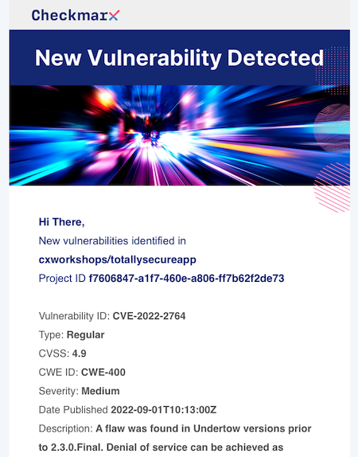

# Lab 3: 3rd Party Code Analysis
In this lab, we will explore some examples of Software Composition Analysis (SCA) vulnerabilities, and how to remediate them. 

{: .important-title }
> Prerequisites
>
> We will be using our __totallysecureapp__ project, which is available at https://github.com/cxworkshops/totallysecureapp. If you have not already done so, clone the project to your local machine, as defined in [Lab 1](../lab1_setup/).

## Introduction

With the accelerating adoption of open source software in their applications, organizations face the challenges of securing their applications when using open source or 3rd party dependencies.  With Checkmarx Software Composition Analysis, organizations can better track, assess, and remediate their 3rd party package vulnerabilities and licensing risks within their projects before it’s too late.

Checkmarx SCA supports all major ecosystems and package managers.  A comprehensive list of supported languages and package managers can be found [here](https://checkmarx.com/resource/documents/en/34965-117822-supported-languages-and-package-managers.html)  

## Reviewing SCA Results

Within the Checkmarx VS Code plugin, ensure you are connected to the project, branch, and scan result as noted in the __Connect to a project__ section in [Lab 1](../lab1_setup/).

1. Navigate to the Checkmarx Plugin in the left menu of VS Code, expand the sca results, and HIGH results

    {: .note }
    SCS Malicious Packages will always be returned in SCA HIGH results. We look at malicious packages in a different lab focused on __Supply Chain Security (SCS)__

    

2. Expand the __Maven-mysql:mysql-connector-java-5.1.26__ result

3. Choose __CVE-2018-3258__ and review the description within the pane opened within VS Code.

        Vulnerability in the MySQL Connectors component of Oracle MySQL (subcomponent: Connector/J). Supported versions that are affected are 8.0.12 and prior. Easily exploitable vulnerability allows low privileged attacker with network access via multiple protocols to compromise MySQL Connectors. Successful attacks of this vulnerability can result in takeover of MySQL Connectors. CVSS 3.0 Base Score 8.8 (Confidentiality, Integrity and Availability impacts). CVSS Vector: (CVSS:3.0/AV:N/AC:L/PR:L/UI:N/S:U/C:H/I:H/A:H).

4. We can see the recommended remediation is to __Upgrade To Version 8.0.28__. Additionally there is a link to the vulnerable package path, which is found within deploy/pom.xml.  Click on __deploy/pom.xml__.

    

5.  Within the __deploy/pom.xml__ file, we can update the MySQL version from __5.1.26__ to version __8.0.28__.

    {: .note }
    While Checkmarx SCA will often have recommendations to upgrade package versions to address found vulnerabilities, we understand it's not always as simple as just changing a version.  We recommend when upgrading package versions, you do so one at a time in a test or staging environment and performing a regression test to ensure no functionality is broken or lost within your application.  In the event that application functionality is affected, we recommend you coordinate with your internal Security organization to define a remediation plan or implement other mitigation steps to minimize the impact of the vulnerability

## Learning more about SCA Results

1. Aside from built-in result information within the Checkmarx Plugin in VSCode, there is a wealth of information available on [Checkmarx's DevHub, devhub.checkmarx.com](https://devhub.checkmarx.com):

    

2. You can see this same result available within the [Vulnerabilities Database](https://devhub.checkmarx.com/cve-details/CVE-2018-3258/).

3. In addition to DevHub, Checkmarx also can provide email notifications of when new vulnerabilities arise related to previously discovered packages within your projects

    

## Integrated SCA Scan Findings in the IDE
Checkmarx has partnered with JetBrains to offer our SCA scan findings free for JetBrains IntelliJ IDEA Ultimate users.  All you have to do is click on our bundled plug-in within your IntelliJ IDEA Ultimate workspace, and you can start scanning for open source threats right away. To learn more, checkout the [Checkmarx and Jetbrains Bundled Plugin](https://checkmarx.com/why-checkmarx/checkmarx-and-jetbrains/)
    

Additionally, we have recently introduced similar functionality within within the VS Code plugin.  No subscription or API key is required, you can simply hit the play button in the lower-left quadrant to perform a scan of project 3rd party package manifests.
    
    

## Key Takeaways

- Checkmarx is constantly monitoring, testing, and updating its database for 3rd party packages for tracking vulnerabilities
- Checkmarx SCA can automatically email you or your security champion when new vulnerabilities are detected within previously identified packages
- Vulnerability data is available in a number of areas, including the Checkmarx One VS Code plugin, [Checkmarx DevHub Vulnerabilities Database](https://devhub.checkmarx.com/advisories/), or within the Checkmarx One web interface itself
- Checkmarx provides SCA scan findings for free within JetBrains IntelliJ IDEA as well as VS Code.