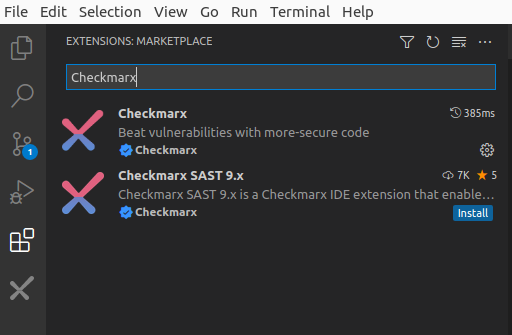
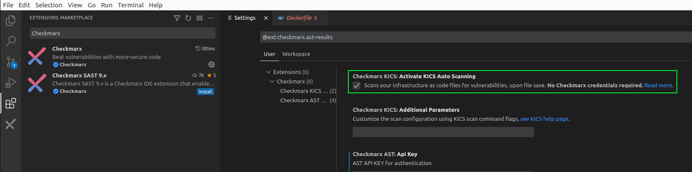
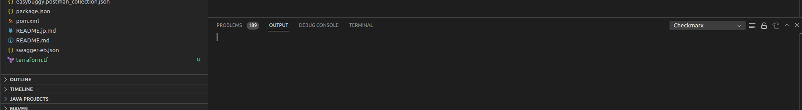
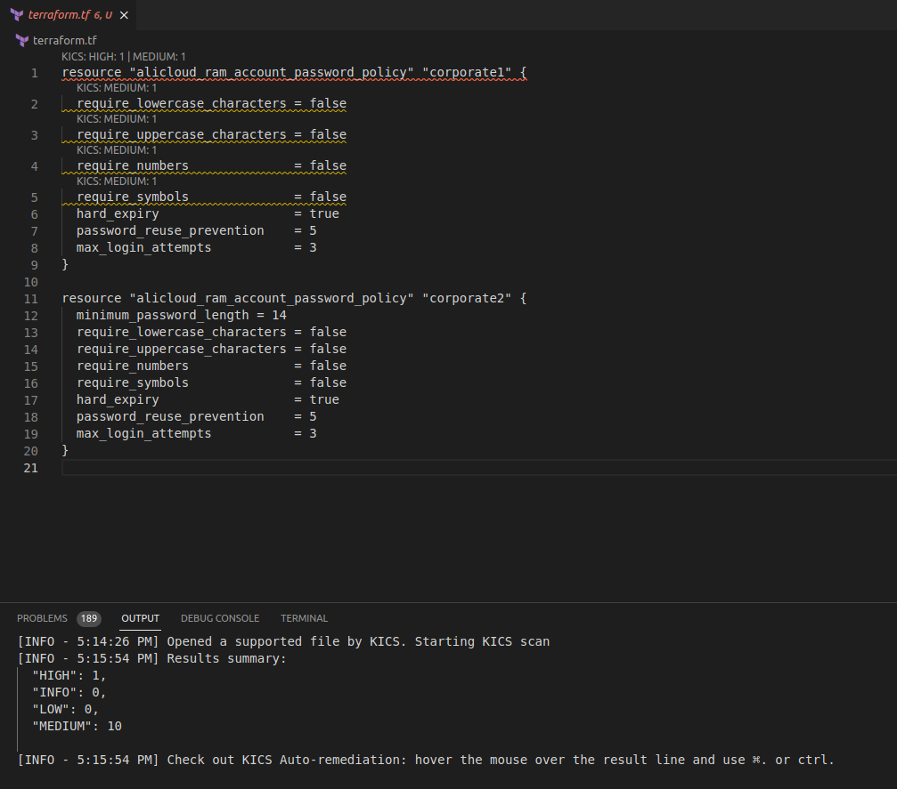
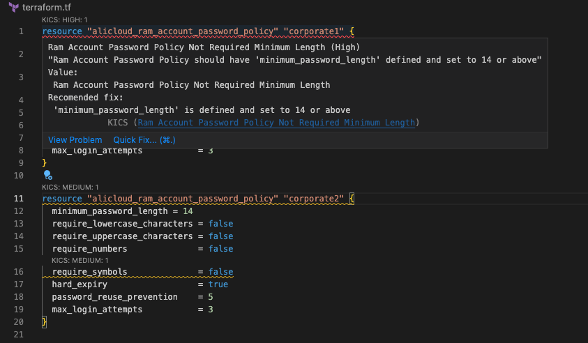
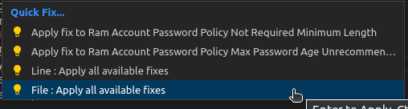
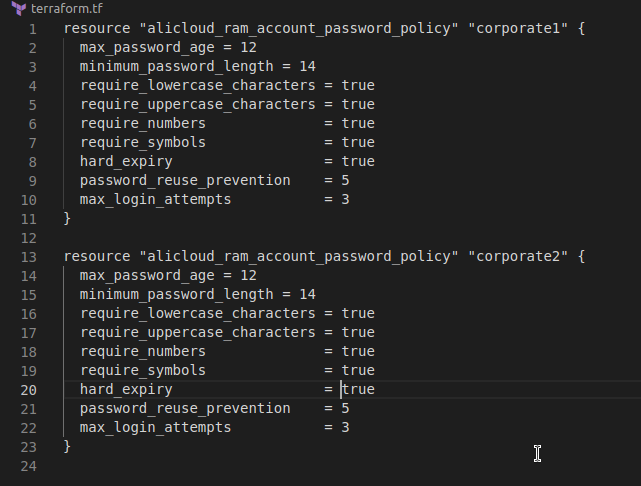

# Lab 5: Infrastructure-as-Code Analysis

{: .important-title }
> Prerequisites
>
> We will be using our __totallysecureapp__ project, which is available at https://github.com/cxworkshops/totallysecureapp. If you have not already done so, clone the project to your local machine, as defined in [Lab 1](../lab1_setup/).

## Introduction

In addition to application source code static analysis, Checkmarx also offers Infrastructure-as-code analysis. We include our IaC scan engine in our Checkmarx One platform, but Checkmarx KICS is also available as an open source solution. KICS finds security vulnerabilities, compliance issues, and infrastructure misconfigurations in the following Infrastructure as Code solutions: Terraform, Kubernetes, Docker, AWS CloudFormation, Ansible, Helm, Google Deployment Manager, AWS SAM, Microsoft ARM, Microsoft Azure Blueprints, OpenAPI 2.0 and 3.0, Pulumi, Crossplane, Knative and Serverless Framework.

With the Checkmarx Visual Studio Plugin, KICS is able to automatically scan whenever an infrastructure-as-code file is opened or saved, and no Checkmarx account is required to do so.

## Enabling Auto-Scan Feature
By default, KICS auto-scan is enabled when the Checkmarx One plugin is installed.  To confirm it is enabled in your environment, follow these steps:

1. Within VS Code, navigate to View > Extensions and type "Checkmarx" in the search bar

    

2. Click the small gear icon on the right and select __Extension Settings__ and confirm that the selection box under __Checkmarx KICS: Activate KICS Auto Scanning__ is enabled:

    

{: .note }
Note that for KICS auto scanning to work in Visual Studio code, you need to have docker installed. Reference [Lab 1](../lab1_setup/) for more information

## Triggering a KICS auto scan

Within our __totallysecureapp__ project, we have a number of infrastructure-as-code files.  For the purposes of this lab, we'll be using the __terraform.tf__ file, located in the root of the project folder.

1. Within the VS Code, ensure you have the Output pane visible (default location is the bottom pane).  If you do not see "OUTPUT," you can toggle the pane by navigating to __View__ > __Output__ or alternatively typing __Ctrl__+__K__ then __Ctrl__+__H__. Ensure that __Checkmarx__ is selected in the drop-down menu to the right of the OUTPUT pane

    

2. Using the file navigator of VS Code, double-click on the __terraform.tf__ file in the root of the project.

3. The Checkmarx Plugin recognizes the Terraform file and automatically initiates a KICS scan.  You should see a message in the output pane noting how the scan has started:

        [INFO - 5:14:26 PM] Opened a supported file by KICS. Starting KICS scan

4.  The KICS scan will run and upon completion, you should see a summary of the results within the Output pane in VSCode

    

5.  Additionally, VS Code applies highlighting to lines with found KICS results along with their severity rating

## Remediating KICS Scan Findings

1.  Within the previously opened Terraform file, mouse-over the first line which should be highlighted in red and a pop-up will appear of the description of the found vulnerability

    

2.  At the bottom of the description pane, there is a link entitled __Quick Fix__.  Click on it

    {: .note }
    You may need to scroll down slightly in the VS Code pop-up to see the Quick Fix link at the bottom

3. You'll be presented with two to four options :
    - Apply fix to Ram account Password Policy Not Required Minimum Length
    - Apply fix to Ram Account Password Policy Max Password Age Unrecommended
    - Line: Apply all available fixes
    - File: Apply all available fixes

4. Choose __File: Apply all available fixes__ to apply all of the KICS recommendations

    

5. KICS will automatically apply the recommendations within the file and you should see the underline highlighting disappear

    

    {: .note }
    While the auto-remediation feature can save time, we generally recommend you apply recommendations one-at-a-time, so you can test its impact and ensure application or container functions are not broken

# Key Takeaways
- Checkmarx includes its Infrastructure-as-code (IaC) scan engine within Checkmarx One and it is known as KICS outside of Checkmarx One
- KICS can be used independently of Checkmarx One, where scans can be performed directly from within the user's environment
- The Checkmarx One plugin can be automatically configured to perform a KICS scan when a recognized IaC file is opened or saved within VS Code
- KICS can automatically highlight and enumarate findings directly within VS Code
- The user has the option of applying recommended remediations automatically, whether line-by-line or across the whole file

